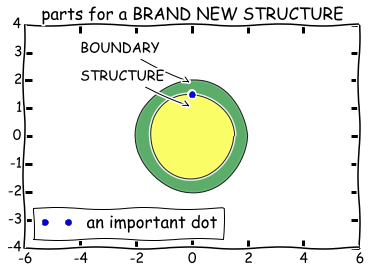
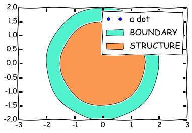
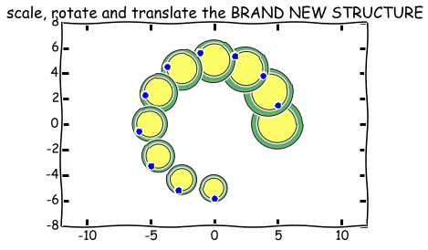

Introduction: How do I work?
============================

.. raw:: html

   <ol>
   <li>

Make one or more BRANDNEWSTRUCTUREs

.. raw:: html

   </li>
   <li>

Give them ANKER-points

.. raw:: html

   </li>
   <li>

Use all\_parts to attach them to each other and generate a documentation

.. raw:: html

   </li>
   <li>

Add everything to a GROUNDPLANE

.. raw:: html

   </li>
   <li>

Export to dxf

.. raw:: html

   </li>
   </ol>

.. code:: python

    # import the ShapelyChipDesigns package: 
    import ShapelyChipDesigns as SD
    
    # import packages for plotting:
    from matplotlib import pyplot as plt
    %pylab inline
    plt.xkcd()

.. parsed-literal::

    Populating the interactive namespace from numpy and matplotlib
    

.. parsed-literal::

    <matplotlib.rc_context at 0x59fbaf0>

Make one or more BRANDNEWSTRUCTUREs
-----------------------------------

.. code:: python

    # make two circles: 
    
    radius1 = 2
    radius2 = 1.5
    
        # they are centered at [0,0]:
    point  = SD.Point([0,0])
    circle1 = point.buffer(radius1)
    circle2 = point.buffer(radius2)
    
    # and an important point:
    
    a_dot = [0, radius2]
.. code:: python

    title('parts for a BRAND NEW STRUCTURE')
    
    annotate(
        'BOUNDARY',
        xy=(0, radius1-0.05*radius1), arrowprops=dict(arrowstyle='->'), xytext=(-4, 3))
    
    annotate(
        'STRUCTURE',
        xy=(0, radius2-0.3*radius2), arrowprops=dict(arrowstyle='->'), xytext=(-4, 2))
    
    SD.showPolygons([circle1, circle2])
    
    plot(a_dot[0], a_dot[1], 'o', label='an important dot')
    
    legend(loc=3)
    gca().set_ylim(-2*radius1, 2*radius1)

.. parsed-literal::

    (-4, 4)

.. code:: python

    C = SD.BRAND_NEW_STRUCTURE(circle1, circle2)
    C.add_anker(a_dot, 'a dot')
    C.show_info()

.. parsed-literal::

    {'a dot': [0, 1.5]}
    

.. code:: python

    title('scale, rotate and translate the BRAND NEW STRUCTURE')
    
    for i in arange(10):
        
        Ccopy = C.make_copy()
        Ccopy.rotate(i*20, [0, 0])
        Ccopy.scale(1-i*0.05, 1-i*0.05, [0, 0])
        Ccopy.translate([5*cos(i*2*pi/12.), 5*sin(i*2*pi/12.)], [0, 0])
        
        SD.showPolygons(Ccopy.get_polygons())
        
        the_dot = Ccopy.get_ankers()['a dot']
        plot(the_dot[0], the_dot[1], 'o', color='blue')

