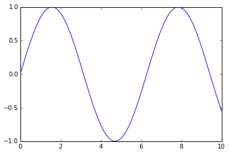

I have a title!
===============

How is markdown rendered?

.. math::  \int f(x) ~ dx 

and formulas :math:`\omega`

.. math::  \sum_{i=0} i 

.. code:: python

    %pylab inline

.. parsed-literal::

    Populating the interactive namespace from numpy and matplotlib
    

.. parsed-literal::

    WARNING: pylab import has clobbered these variables: ['f']
    `%matplotlib` prevents importing * from pylab and numpy
    

.. code:: python

    x = linspace(0, 10, 100)
    plot(x, sin(x))

.. parsed-literal::

    [<matplotlib.lines.Line2D at 0x87246b0>]

.. code:: python

    print 'i am a notebook part'

.. parsed-literal::

    i am a notebook part
    

.. code:: python

    !ipython nbconvert hello.ipynb --to rst

.. parsed-literal::

    [NbConvertApp] Using existing profile dir: u'C:\\Users\\annahambi\\.ipython\\profile_default'
    [NbConvertApp] Converting notebook hello.ipynb to rst
    [NbConvertApp] Support files will be in hello_files\
    [NbConvertApp] Loaded template rst.tpl
    [NbConvertApp] Writing 1195 bytes to hello.rst
    

.. code:: python

    f = open('hello.rst', 'r')
    content = f.read()
    f.close()
    content = content.replace('/','/')
    
    f = open('hello.rst', 'w')
    f.write(content)
    f.close()
